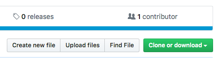
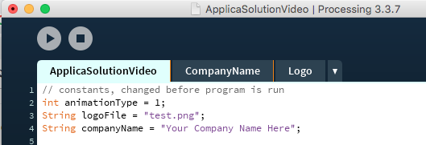
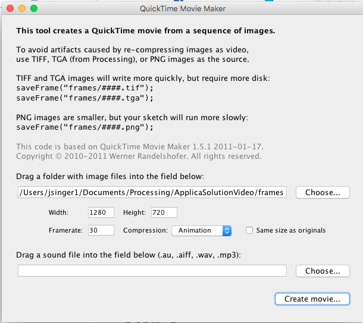

# ApplicaSolutionVideo
take in a photo and text as an input, producing an animated video as an output using Processing (Java). 
<b>Note:</b> if you already have processing and the files are already downloaded, proceed to step 4.

<h1> Step 1 </h1>
Download the most recent version of Precessing found below if you havent already:  
<a href = "https://processing.org/download/">https://processing.org/download/</a>

<h1> Step 2 </h1>
Download the files from this repository using the green button at the top-right that says "clone or download", be sure that they are all in the same folder. Also be sure that the client's logo is in that folder as well.

<h1> Step 3 </h1>
Once downloaded, open the file "ApplicaSolutionVideo.pde" using Processing

<h1> Step 4 </h1>
At the top of the code, input the name of the logo file and the client company name and their animation type

<h1> Step 5 </h1>
Run the code using either command-R or the play button at the top of the screen; each frame of animation will be saved into a folder titled "frames" in the folder containing the code 
<b>Note:</b> before you run be sure to delete the "frames" folder if it exists

<h1> Step 6 </h1>
With Processing open, in the top bar, click the drop down titled "tools" and select "Movie Maker"
 

<h1> Step 7 </h1>
Input the location of the frames folder. Set the width to 1280, the height to 720, framerate to 30, and the compression to animation. Then create movie. Name it whatever it needs to be named and save it to a good location.

