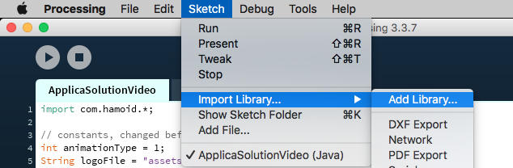

# ApplicaSolutionVideo
Takes in a photo and text as an input, producing an animated video as an output using Processing (Java).
 
<b>Note:</b> if you already have processing, FFmpeg, and the files are already downloaded, proceed to step 4.

<h1> Step 1: Download Processing </h1>
Download the most recent version of Precessing found below if you havent already:  
<a href = "https://processing.org/download/">https://processing.org/download/</a>

<h1> Step 2: Download FFmpeg </h1>
Download the most recent static build of FFmpeg for your computer found below if you havent already, remember where you save the file:  
<a href = "https://ffmpeg.org/">https://ffmpeg.org/</a>

<h1> Step 3: Download the code </h1>
Download the files from this repository using the green button at the top-right that says "clone or download", be sure that they are all in the same folder. Also be sure that the client's logo is in that folder as well.

<h1> Step 4: Open the file in Processing </h1>
Once downloaded, open the file "ApplicaSolutionVideo.pde" using Processing

<h1> Step 5: Download the Video Export Library </h1>
In the top bar select sketch > import library > add library

In the search bar, find the library titled "Video Export", click it and install the library. You will see a green chech mark next to the library when done.  
Now do the same thing with the library titled "Video", it should look like this when done:

<h1> Step 6: Input the client's information </h1>
At the top of the code, input the name of the logo file and the client company name, their animation type, and the name of the new video file.

<h1> Step 7: Run the code </h1>
Run the code using either command-R or the play button at the top of the screen 
<b>NOTE: </b>The first time you run the sketch, it will ask you for the location of the FFmpeg file, click "ok" and navigate to the file's location.
 
 
The new video file will be located in the same folder as applicaSolutionVideo.pde
